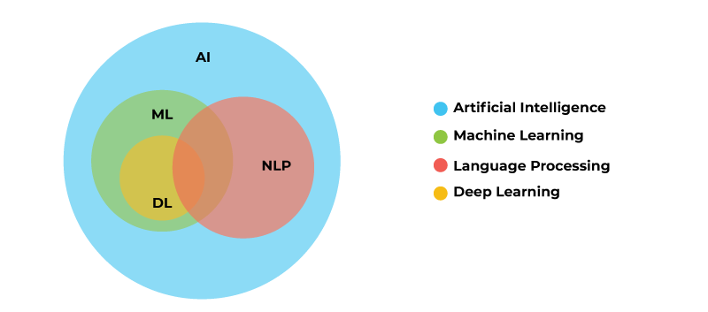

# NLP-Deep-Learning-Fundamentals

**NLP-Deep-Learning-Fundamentals** is a repository that aims to provide a comprehensive introduction to the fundamentals of deep learning for natural language processing. The repository includes a range of resources such as tutorials, code examples, and projects that cover various NLP tasks such as text classification, sentiment analysis, language translation, and named entity recognition. The tutorials and examples are designed to be beginner-friendly, providing step-by-step guidance on how to implement deep learning models in popular frameworks such as PyTorch and TensorFlow. The projects included in the repository are designed to provide hands-on experience and help users solidify their understanding of the concepts covered in the tutorials. The repository also includes pre-processing techniques like tokenization, stemming, lemmatization and other NLP pre-processing techniques. This repository is a perfect starting point for anyone looking to get started with deep learning for natural language processing.

## Week 1: Introduction to NLP and Deep Learning

- Understand the basic concepts of natural language processing and deep learning
- The different NLP tasks and how they are typically approached using deep learning
- The basic pre-processing techniques for text data

## Week 2: Neural Network Fundamentals

- Understand the basics of building and training neural networks
- The different types of neural networks and their applications in NLP

## Week 3: Text Classification and Sentiment Analysis

- The text classification and sentiment analysis
- Implement text classification and sentiment analysis using PyTorch or TensorFlow

## Week 4: Word Embeddings and Language Models

- Word Embeddings and how they are used in NLP
- The language models and how they are used for tasks such as text generation and machine translation

## Week 5: Sequence-to-Sequence Models

- Sequence-to-Sequence models and how they are used for tasks such as machine translation
- Implement a simple machine translation model using PyTorch or TensorFlow

## Week 6: Named Entities Recognition

- Named Entities Recognition and how it is used in NLP
- Implement a named entities recognition model using PyTorch or TensorFlow

## Week 7: Advanced NLP Techniques

- Advanced NLP techniques such as attention mechanisms and transformers
- Implement a transformer model using PyTorch or TensorFlow

## Week 8: Evaluation and Deployment

- Evaluating the performance of deep learning models for NLP tasks
- Deploying NLP models in a production environment
- Understand the importance of monitoring and maintaining NLP models in production

## Week 9: Advanced Topics in NLP

- Advanced topics such as transfer learning, active learning, and unsupervised techniques in NLP
- Understand the importance of data cleaning, data annotation and data augmentation.

## Week 10: Text Generation

- Text Generation using GPT-2, GPT-3 and other models
- Implement a simple text generation model using PyTorch or TensorFlow

## Week 11: Dialogue Systems

- Dialogue Systems and how they are used in NLP
- Implement a simple dialogue system using PyTorch or TensorFlow

## Week 12: Text Summarization

- Text Summarization and its different techniques
- Implement a simple text summarization model using PyTorch or TensorFlow

## Week 13: Text-to-Speech and Speech-to-Text
- Text-to-Speech and Speech-to-Text and their applications
- Implement a simple Text-to-Speech and Speech-to-Text model using PyTorch or TensorFlow

## Week 14: Advanced topics in NLP
- Advanced topics such as BERT, XLNet, RoBERTa and other models
- Understand the importance of fine-tuning pre-trained models

## Week 15: Final Projects and Interview Questions

- Apply what you've learned to a final project of your choice, such as building a chatbot or a machine summarization model
- Importance interview questions
